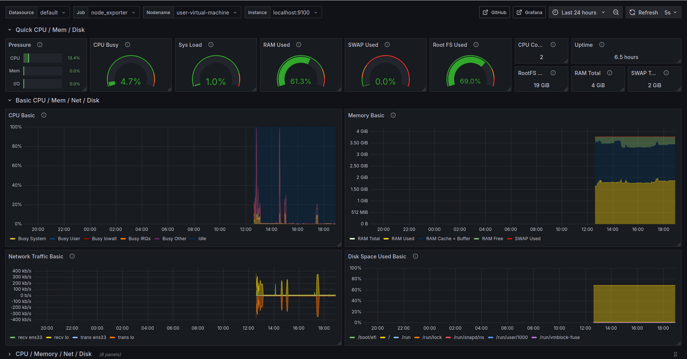

# 📊 Monitorización con Prometheus, Node Exporter y Grafana

Proyecto de monitorización profesional para sistemas Linux con Prometheus y Grafana. Incluye instalación automática, alertas básicas y dashboards listos para usar.

## 📚 Índice

- [📌 Descripción](#descripción)
- [🏢 Aplicación empresarial](#aplicación-empresarial)
- [⚙️ Requisitos](#requisitos)
- [🚀 Instalación](#instalación)
- [📈 Visualización](#visualización)
- [📢 Alertas](#alertas)
- [📸 Capturas](#capturas)
- [💡 Mejoras futuras](#mejoras-futuras)
- [👨‍💻 Autor](#autor)

## 🏢 Aplicación empresarial

Este sistema permite:

- Monitorizar CPU, RAM, disco, red y servicios.
- Detectar problemas antes de que ocurran.
- Ver gráficas en tiempo real de forma visual (Grafana).
- Automatizar alertas para saber si un servidor está caído.

Ventajas respecto a otras soluciones:

| Herramienta      | Gratuito | Fácil de usar | Visual | Escalable |
|------------------|----------|----------------|--------|-----------|
| **Este proyecto**| ✅       | ✅             | ✅     | ✅        |
| Zabbix           | ✅       | ❌             | ❌     | ✅        |
| Nagios           | ✅       | ⚠️             | ❌     | ⚠️        |
| Datadog          | ❌       | ✅             | ✅     | ✅        |


## ⚙️ Requisitos

- Servidor Ubuntu/Debian
- Acceso sudo
- Puertos 9090 (Prometheus), 9100 (Node Exporter), 3000 (Grafana)


## 🚀 Instalación paso a paso

```bash
# 1. Clona el repositorio
git clone https://github.com/Teodosiodg2002/monitorizacion-red.git
cd monitorizacion-red

# 2. Da permisos a los scripts
chmod +x scripts/*.sh

# 3. Instala Prometheus
sudo ./scripts/instalar_prometheus.sh

# 4. Instala Node Exporter
sudo ./scripts/instalar_node_exporter.sh

# 5. Instala Grafana
sudo ./scripts/instalar_grafana.sh

# 6. Configura alertas
sudo ./scripts/configurar_alertas.sh
```

## 📈 Visualización

Accede a las herramientas de monitorización a través de las siguientes URLs:

- Prometheus → [http://localhost:9090](http://localhost:9090)
- Node Exporter → [http://localhost:9100](http://localhost:9100)
- Grafana → [http://localhost:3000](http://localhost:3000) (usuario/contraseña: admin/admin)

🔄 Importa el dashboard desde `dashboards/node_exporter_dashboard.json`.

- Prometheus → http://localhost:9090
- Node Exporter → http://localhost:9100
- Grafana → http://localhost:3000 (usuario/contraseña: admin/admin)

🔄 Importa el dashboard desde `dashboards/node_exporter_dashboard.json`.


## 📢 Alertas incluidas

| Nombre            | Condición                    | Acción esperada |
|-------------------|------------------------------|------------------|
| High CPU usage    | CPU > 90% durante 2 minutos   | Notificación     |
| Low Disk Space    | Espacio libre < 10%           | Notificación     |
| Node Down         | Sin métricas en 5 minutos     | Alerta crítica   |

📁 Configuradas en `alertas/alertas_basicas.yml`


## 📸 Capturas

### 🎛️ Panel de Grafana



## 💡 Mejoras futuras

- [ ] Integrar Alertmanager
- [ ] Añadir exporters (MySQL, Docker, Redis)
- [ ] Configurar alertas por correo o Slack
- [ ] Automatizar despliegue con Docker o Ansible


## 👨‍💻 Autor

Teodosio Donaire González  
📧 teodonaire@gmail.com  
🔗 [LinkedIn](https://www.linkedin.com/in/teodosio-donaire-gonz%C3%A1lez-b94251316/) | [GitHub](https://github.com/Teodosiodg2002)
